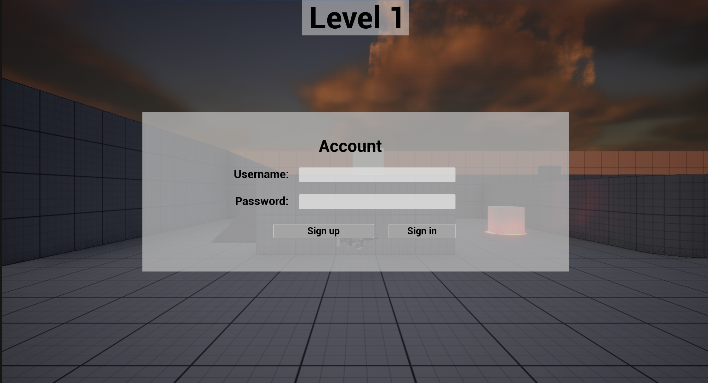
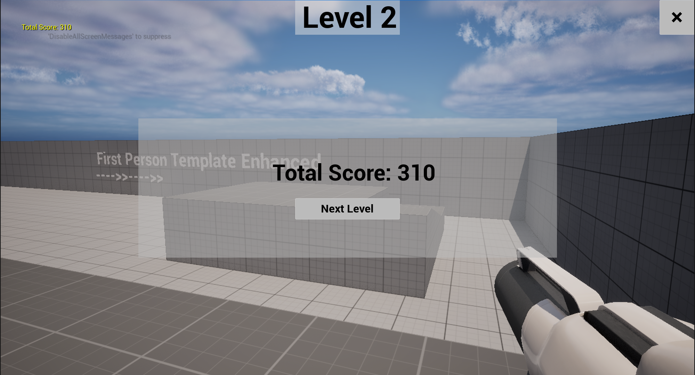
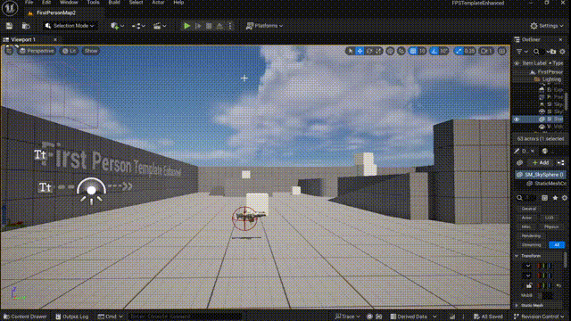
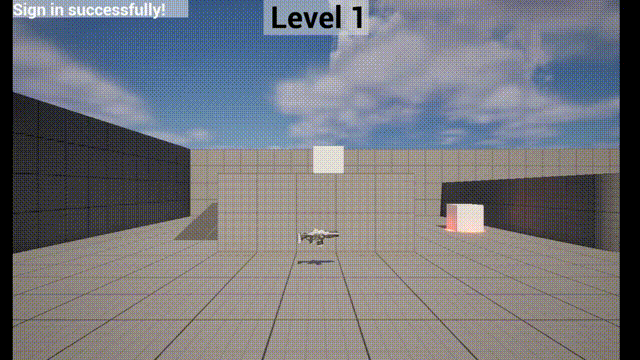
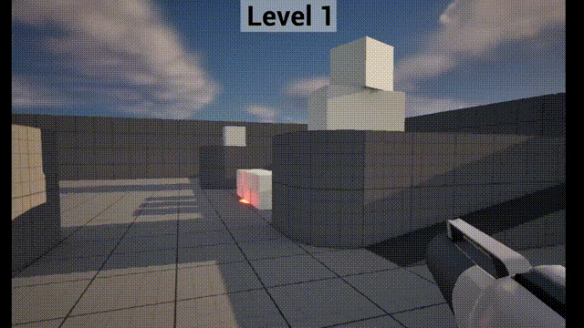

## FPSTemplateEnhanced Document
----
### 游戏介绍
- 进入游戏，首先出现登录界面，输入账号和密码之后点击`Sign Up`按钮注册账号，然后使用正确的账号密码点击`Sign In`按钮登录。登陆后进入关卡一（Level 1），关卡一限时20秒，你需要捡起前方的枪，对场景内的方块进行射击来获得分数，时间结束后出现你的总分数，点击`Next Level`进入第二关，第二关限时60秒，同样地，你需要捡起前方的枪，对场景内的方块和敌人射击来获得分数，注意敌人的躲避，时间结束后点击右上角的`×`按钮退出游戏，或点击`Next level`重复第二关的游戏过程。

### 1、游戏登录系统和用户界面
- C++代码实现登录逻辑
- 采用控件蓝图UI外观编辑
- `UStartUserWidget`类，在该登录界面类中，首先进行控件绑定，然后`SignInButtonClicked`和`SignUpButtonClicked`函数用于实现注册和登录按钮的功能，先从通过文本框获取用户输入的账号密码，通过三个辅助函数`CheckAccountFile`、`SaveAccountFile`和`LoadAccountFile`对账号密码进行判断，实现登录的功能。采用控件蓝图编辑器对UI进行编辑并将其联系到C++代码。在`AFPSTemplateEnhancedGameMode`类中动态地对`UStartUserWidget`类进行操作，通过`DECLARE_DYNAMIC_MULTICAST_DELEGATE(FOnAccountAction)`进行消息传递。
- `UGameOverUserWidget`类，在该类中实现加载下一关卡的逻辑。其他用户界面如关卡卡提示、退出按钮等均以蓝图类的形式在`AFPSTemplateEnhancedGameMode`类中被操作。

### 2、游戏AI敌人实现
- `AEnemyCharacter`类和`AEnemyAIController`类C++代码实现了AI敌人随机位置巡逻，看见玩家后追逐玩家的功能。
- `AEnemyCharacter`类：`UPawnSensingComponent`组件添加敌人的视觉系统，在看见玩家后调用`AEnemyCharacter`中的追逐玩家实现；`TakeDamage`实现敌人被子弹击打后的击退效果和敌人分数系统；`NotifyHit`实现敌人撞墙后的反弹效果。
- `AEnemyAIController`类则通过`ChasePlayer`、`SetRandomPatrolPoint`、`Patrol`、`CheckPosition`等函数实现追逐玩家的逻辑、随机点生成、敌人巡逻的逻辑、敌人出现位置不懂的情况下的逻辑实现。

### 3、光线设计
- C++代码实现昼夜变换
- `ADayNightCycleActor`类添加一个`ADirectionalLight`的Actor，每一帧绕x轴旋转一定角度，在虚幻编辑器中设定关卡中的DirectionalLight和角度。
- `ALightActor`类添加`USkyLightComponent`组件，让夜晚也有光源不至于死黑。

### 4、方块及重要目标设计
- `CubeActor`类重写`OnHit`函数实现方块被击中一次后的缩放、被击中两次后的消失。`AFPSTemplateEnhancedGameMode`类在游戏开始时获取世界内的所有`CubeActor`，随机设置重要目标，为方块添加`UPointLightComponent`组件实现发光。

